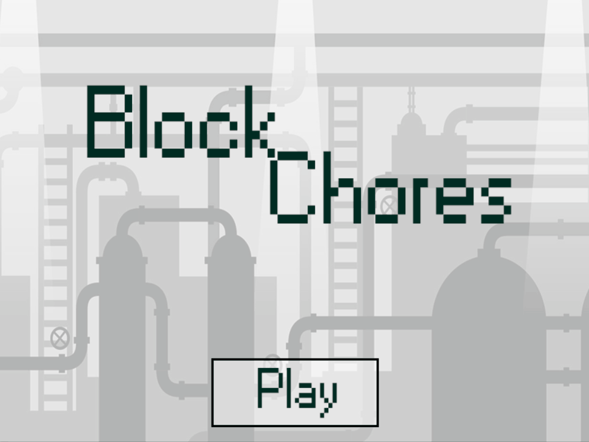

# BlockChores

BlockChores is a simple Ores clone made in C++ with SDL 2.0.12.

# How To Run

Simply clone the repository and open the Visual Studio solution with VS 2019 (other versions not tested).
